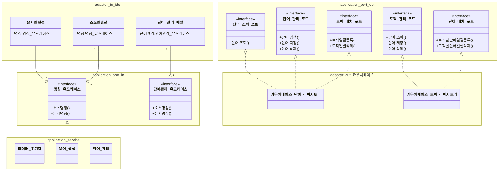

# 참고 링크
https://github.com/JetBrains/intellij-platform-plugin-template
https://plugins.jetbrains.com/docs/intellij/intellij-platform.html
# 구현 목표
- IDE
  - 단어 관리 UI
  - Intention
    - 주석내 1번째 라인데 특정 "패턴"으로 시작 하는 주석이 있을 경우 단어사전 기반 명칭관리됨
    - 범위
      - 클래스명
      - 메소드명
      - 클래스 변수명
      - ENUM
      - postfix (적용 대상 등 정의 필요.)
      - prefix (요건 미정.)
      - 그외는 구현 내용에 따라..
    - 명칭 변경 관련 전후 액션 정의 필요.
      - 명칭 변경이 확정시 리네임 리펙토링 제안.
    - 위 범위에 해당되는 영역에 인텐션일 경우 
      - "패턴"에 미매칭 될경우 적용 여부 처리 필요.
    - "용어사전 사용 패턴" 
      - "# 제안 명칭" 미정.
      - 1라인.
- 단어
  - 단어 관리
    - 단어 기준은 토픽별 영어 축약어.
    - 그외 언어별 다국어 처리.
  - 단어 제안
  - 신규 단어
  - 토픽별 단어 분류
  - 공공데이터 "표준단어사전" 마이그레이션 방안 검토.(https://www.data.go.kr/index.do)
    - [「공공데이터 공통표준용어」 6차 제개정 안내](https://www.data.go.kr/bbs/rcr/selectRecsroom.do?pageIndex=1&originId=PDS_0000000001165+++&atchFileId=FILE_000000002835674&searchCondition3=&searchCondition2=2&cndCtgryLaword=Y&cndCtgryEdc=Y&cndCtgryBigdata=Y&cndCtgryStd=Y&cndCtgryNews=Y&cndCtgryContest=&cndCtgryEtc=Y&cndCtgryCardNews=&bindCndCtgry=PDTY01%2CPDTY02%2CPDTY03%2CPDTY04%2CPDTY05%2CPDTY06&sort-post=2&searchKeyword1=공통표준용어&Laword=PDTY01&Edc=PDTY02&Bigdata=PDTY03&Std=PDTY04&News=PDTY05&Etc=PDTY06)
  - 프로젝트
    - 필요에 따라 적용 토픽 설정
    - 사용자 정의 단어 추가.
    - 사용자 정의 토픽 추가.
    - 기존 정의된 토픽에 사용자 정의 단어 추가.
      - 마이그레이션된 단어와 사용자 정의 단어 겹치지 않도록 고민 필요.
  - 임베디드 DB 사용 고민.
    - Couchbase-Lite
    - https://plugins.jetbrains.com/docs/intellij/persisting-state-of-components.html

## 문서 용어
- 소스명칭: 클래스명 또는 메소드명
- 문서명칭: 주석에 있는 클래스 또는 메소드 명칭

## 상태
- Commont 정보 속성(설정위치 추가 설명 필요.)
  * 반영, 미사용, 오류
- 용어 상태
  * 미정.

## 구현 영역
- IDE 에디터 UI
  - 인텐션
- 단어
  - 에디터 용어 제공 서비스
  - 단어 관리 서비스
  - 용어 설정 서비스
- IDE 옵션 UI
  - 단어 관리 UI
  - 용어 설정 UI
- 디비
  - 단여 관리 컬렉션
  - 토픽 관리 컬렉션(? 실사용 미정.)
    - 사용자 단어.
    - 「공공데이터 공통표준용어」 6차
## 프로세서 

### IDE UI 프로세서들

#### 소스 -> Commont 인텐션 프로세스
1. 대상
- 클래스명(PsiIdentifier)
- 메소드명
- 전역변수,Enum (현재) 미정.
2. 노출 조건 상세 프로세서
- javadoc가 없을 경우
  * javadoc 생성
  * (플러그인 요청으로 생성가능한지 확인, 불가능시 제외.)
- javadoc있고, 용어사전을 미사용 하는 경우.
  * [소스명칭 -> 문서명칭 변경 프로세스](#소스명칭---문서명칭-변경-프로세스) 적용.
  
- javadoc있고, 용어사전을 사용하지만 용어가 맞지 않는 경우.
  * [문서명칭 -> 소스명칭 변경 프로세스](#문서명칭---소스명칭-변경-프로세스) 적용.

#### Commont -> 소스 인텐션 프로세스
1. 대상
- 클래스,메소드등의 주석 "용어사전 사용 패턴" 일경우.
2. 노출 조건
- "용어사전 사용 패턴" 적용이 안된 경우.
  * 소스명칭,문서명칭 중 선택에 따라 적용 할수 있게 메시지창 띄움.
  * 선택에 따라 아래 프로세스 적용.
    * [소스명칭 -> 문서명칭 변경 프로세스](#소스명칭---문서명칭-변경-프로세스) 적용.
    * [문서명칭 -> 소스명칭 변경 프로세스](#문서명칭---소스명칭-변경-프로세스) 적용.
- "용어사전 사용 패턴" 적용은 되었으나, 용어사전 룰에 소스명칭이 작성 안된 경우
  * 위 내용과 동일 하게 적용.
- "용어사전 사용 패턴" 적용은 되었으나, 이후 클래스명 또는 메소드명 변경 안할 경우.
  * Commont 속성정보에 미적용 정보 추가.
  * UI 상에 미적용 아이콘 추가.
- "용어사전 사용 패턴" 적용은 되었으나, "용어사전 사용 패턴"을 제거 할경우.
  * "용어사전 사용 패턴" 제거 및 Commont 속성정보 설정된 정보 제거.

#### 백그라운드 프로세스
1. 가능 여부 확인.
2. 적용된 소스를 찾아 문서명칭,소스명칭 비교 하여 다를 경우 오류 표시

### 용어 사전 관련 프로세서들

#### 문서명칭 -> 소스명칭 변경 프로세스
* 문서명칭 기준으로 소스명칭 생성.
* 리네임 리팩토링을 통해 작업되도록 기능 확인 필요.

#### 소스명칭 -> 문서명칭 변경 프로세스
* 소스명칭 기준으로 문서명칭 생성.
* 생성된 문서 명칭을 "용어사전 사용 패턴" 따라 주석에 반영. 

#### 용어 오류 확인 프로세스
* 소스명칭 기준으로 문서명칭 생성.
* 동일 여부 확인.

#### 최초 설정 초기화 프로세스
* 플러그인 디렉토리 존재 여부 확인
* 플러그인 최초 실행시 데이터 자동 주입
  * 토픽 & 단어.

#### 

https://mermaid.js.org/syntax/classDiagram.html

## 개발시 이슈 사항
1. 기본 intellj  라이브러라가 인식 안될 경우.
   1. IntelliJ IDEA를 기본 SDK로 설정
      - IntelliJ IDEA에서 File -> Project Structure로 이동합니다.
      - 왼쪽 메뉴에서 SDKs를 클릭합니다.
      - 플러그인 개발에 사용하고자 하는 IntelliJ IDEA 버전이 목록에 없으면 + 버튼을 눌러 추가합니다.
      - Apply 또는 OK 버튼을 눌러 변경사항을 적용합니다.

## 기타.
- 형태소 분석기 : 
  1. https://github.com/bareun-nlp
  2. https://github.com/bab2min/Kiwi
  3. https://github.com/kakao/khaiii
  4. https://needjarvis.tistory.com/740
- ai...??
- 