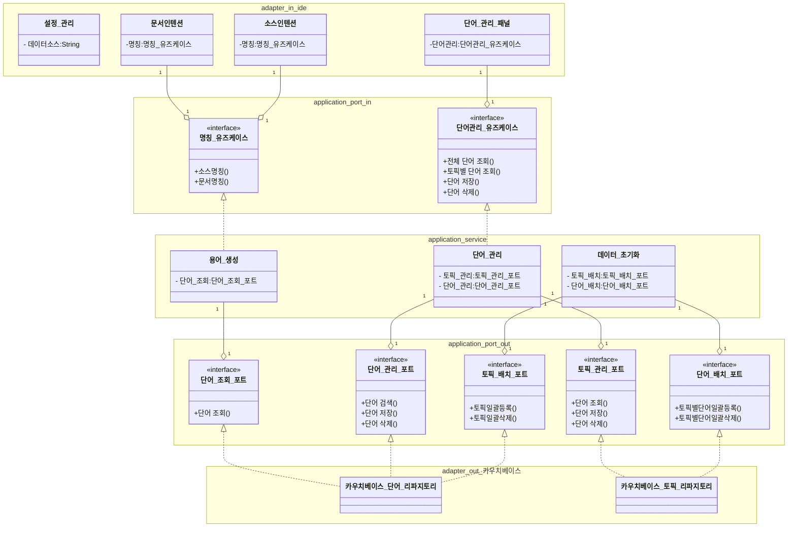

## 프로세서

### IDE UI 프로세서들

#### 소스 -> Commont 인텐션 프로세스
1. 대상
- 클래스명(PsiIdentifier)
- 메소드명
- 전역변수,Enum (현재) 미정.
2. 노출 조건 상세 프로세서
- javadoc가 없을 경우
    * javadoc 생성
    * (플러그인 요청으로 생성가능한지 확인, 불가능시 제외.)
- javadoc있고, 용어사전을 미사용 하는 경우.
    * [소스명칭 -> 문서명칭 변경 프로세스](#소스명칭---문서명칭-변경-프로세스) 적용.

- javadoc있고, 용어사전을 사용하지만 용어가 맞지 않는 경우.
    * [문서명칭 -> 소스명칭 변경 프로세스](#문서명칭---소스명칭-변경-프로세스) 적용.

#### Commont -> 소스 인텐션 프로세스
1. 대상
- 클래스,메소드등의 주석 "용어사전 사용 패턴" 일경우.
2. 노출 조건
- "용어사전 사용 패턴" 적용이 안된 경우.
    * 소스명칭,문서명칭 중 선택에 따라 적용 할수 있게 메시지창 띄움.
    * 선택에 따라 아래 프로세스 적용.
        * [소스명칭 -> 문서명칭 변경 프로세스](#소스명칭---문서명칭-변경-프로세스) 적용.
        * [문서명칭 -> 소스명칭 변경 프로세스](#문서명칭---소스명칭-변경-프로세스) 적용.
- "용어사전 사용 패턴" 적용은 되었으나, 용어사전 룰에 소스명칭이 작성 안된 경우
    * 위 내용과 동일 하게 적용.
- "용어사전 사용 패턴" 적용은 되었으나, 이후 클래스명 또는 메소드명 변경 안할 경우.
    * Commont 속성정보에 미적용 정보 추가.
    * UI 상에 미적용 아이콘 추가.
- "용어사전 사용 패턴" 적용은 되었으나, "용어사전 사용 패턴"을 제거 할경우.
    * "용어사전 사용 패턴" 제거 및 Commont 속성정보 설정된 정보 제거.

#### 백그라운드 프로세스
1. 가능 여부 확인.
2. 적용된 소스를 찾아 문서명칭,소스명칭 비교 하여 다를 경우 오류 표시

### 용어 사전 관련 프로세서들

#### 문서명칭 -> 소스명칭 변경 프로세스
* 문서명칭 기준으로 소스명칭 생성.
* 리네임 리팩토링을 통해 작업되도록 기능 확인 필요.

#### 소스명칭 -> 문서명칭 변경 프로세스
* 소스명칭 기준으로 문서명칭 생성.
* 생성된 문서 명칭을 "용어사전 사용 패턴" 따라 주석에 반영.

#### 용어 오류 확인 프로세스
* 소스명칭 기준으로 문서명칭 생성.
* 동일 여부 확인.

#### 최초 설정 초기화 프로세스
* 플러그인 디렉토리 존재 여부 확인
* 플러그인 최초 실행시 데이터 자동 주입
    * 토픽 & 단어.

#### 대략적인 클래스 다이어그램.
- UI관련 내용 제외 하고, 헥사고날 아키텍처 기반으 정리.

https://mermaid.js.org/syntax/classDiagram.html